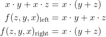

# Lab 1: Filip Kounicky 230597


### De Morgan's laws

1. Equations of all three versions of logic function f(c,b,a):

   

2. Listing of VHDL architecture from design file (`design.vhd`) for all three functions:

```vhdl
architecture dataflow of gates is
begin
    f_org_o  <= (not(b_i) and a_i) or (not(c_i) and not(b_i));
    f_nand_o <= (((b_i nand b_i) nand a_i) nand ((c_i nand c_i) nand (b_i nand b_i)))
    f_nor_o  <= (b_i nor (a_i nor(c_i nor c_i)));
end architecture dataflow;
```

3. Complete table with logic functions' values:

| **c** | **b** |**a** | **f(c,b,a)_ORG** | **f(c,b,a)_NAND** | **f(c,b,a)_NOR** |
| :-: | :-: | :-: | :-: | :-: | :-: |
| 0 | 0 | 0 | 1 | 1 | 1 |
| 0 | 0 | 1 | 1 | 1 | 1 |
| 0 | 1 | 1 | 0 | 0 | 0 |
| 0 | 1 | 0 | 0 | 0 | 0 |
| 1 | 0 | 0 | 0 | 0 | 0 |
| 1 | 0 | 1 | 1 | 1 | 1 |
| 1 | 1 | 0 | 0 | 0 | 0 |
| 1 | 1 | 1 | 0 | 0 | 0 |

4. Screenshot with simulated EPWaveforms to confirm correctness of NAND and NOR functions:


### Distributive laws

1. First Distributive Law:

   

2. Second Distributive Law:

   

3. Listing of VHDL architecture from design file (`design.vhd`) for both functions:

```vhdl
architecture dataflow of gates is
begin
    f_D1_L_o <= (a_i and b_i) or (a_i and c_i);
    f_D1_R_o <= a_i and (b_i or c_i);
    f_D2_L_o <= (a_i or b_i) and  (a_i or c_i);
    f_D2_R_o <= a_i or (b_i and c_i);
end architecture dataflow;
```

4. Screenshot with simulated time waveforms. 

   


#### Link to EDA Playground example with De Morgan's laws and Distributive laws:

   [https://www.edaplayground.com/x/Fa85](https://www.edaplayground.com/x/Fa85 "De Morgan's laws")

   [https://www.edaplayground.com/x/D6u3](https://www.edaplayground.com/x/D6u3 "Distributive laws")
