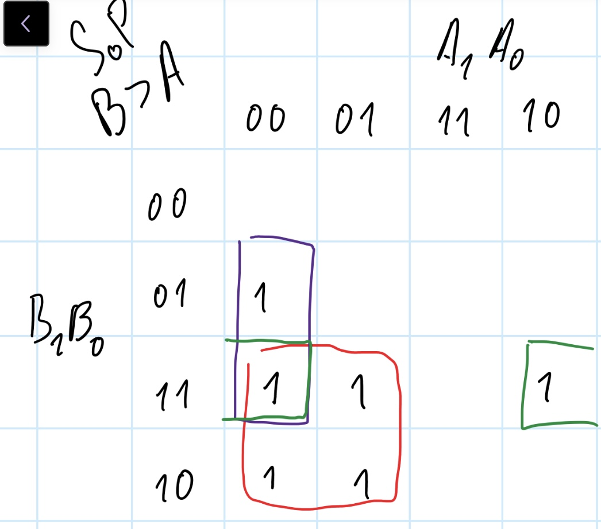
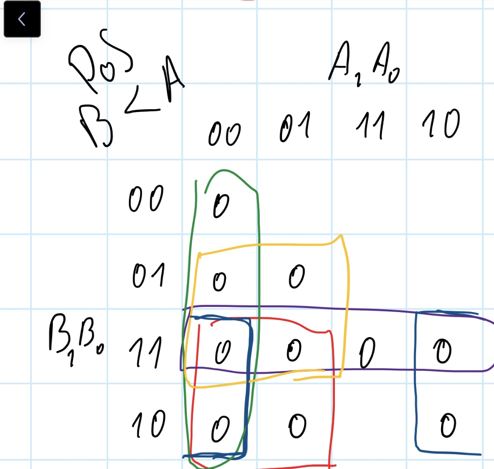
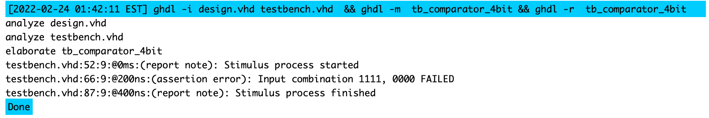

# Lab 2: Filip Kounicky 230597

### 2-bit comparator

1. Karnaugh maps for other two functions:

   Greater than:

   

   Less than:

   

2. Equations of simplified SoP (Sum of the Products) form of the "greater than" function and simplified PoS (Product of the Sums) form of the "less than" function.

  

### 4-bit comparator

1. Listing of VHDL stimulus process from testbench file (`testbench.vhd`) with at least one assert (use BCD codes of your student ID digits as input combinations). Always use syntax highlighting, meaningful comments, and follow VHDL guidelines:

   Last two digits of my student ID: **xxxx97**

```vhdl
    p_stimulus : process
    begin
        -- Report a note at the beginning of stimulus process
        report "Stimulus process started" severity note;

         -- Test case for last two numbers of student ID
        s_b <= "1001"; s_a <= "0111"; wait for 100 ns;
        -- ... and its expected outputs
        assert ((s_B_greater_A = '1') and
                (s_B_equals_A  = '0') and
                (s_B_less_A    = '0'))
        -- If false, then report an error
        -- If true, then do not report anything
        report "Input combination 1001, 0111 FAILED" severity error;

        -- Second test case  INTENTIONAL mistake
        s_b <= "1111"; s_a <= "0000"; wait for 100 ns;
        assert ((s_B_greater_A = '0') and
                (s_B_equals_A  = '0') and
                (s_B_less_A    = '1'))       -- B is clearly greater than A
        report "Input combination 1111, 0000 FAILED" severity error;

        -- Report a note at the end of stimulus process
        report "Stimulus process finished" severity note;
        wait;
    end process p_stimulus;
```

2. Text console screenshot during your simulation, including reports.

    

#### _Link to  public EDA Playground examples:_
   1. 2-bit comparator – [https://edaplayground.com/x/979V](https://edaplayground.com/x/979V "2-bit comparator")
   
   2. 4-bit comparator – [https://edaplayground.com/x/sjBe](https://edaplayground.com/x/sjBe "4-bit comparator")


